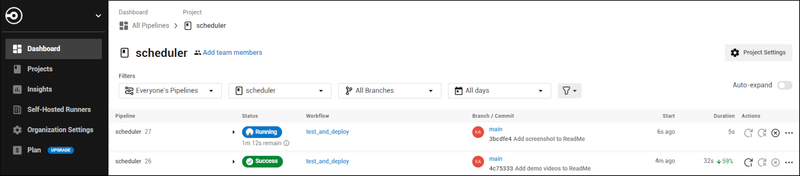

# Interview Scheduler 📅

Interview Scheduler is a full-stack app that connects students to mentors by enabling them to view, book, edit, or cancel interview appointment bookings.

## Features: 

- Built using Test Driven Development (TDD)
- Single Page Application (SPA) design
- Full CRUD (Create, Read, Update, Delete) functionality
- Uses a PostgreSQL database for persistent data storage
- Implements Continuous Integration / Continuous Deployment (CI/CD) with built-in automated testing capabilities

View a live demo [HERE](https://student-interview-scheduler.netlify.app/)

## Final Product

**Video of functionality:**

https://github.com/kazvee/scheduler/assets/109990289/3c60e71c-5562-438f-b21a-d22b7da7846c

**Video of Cypress test runner:**

https://github.com/kazvee/scheduler/assets/109990289/c4b6eb64-4c2e-4d90-b521-71fea6d6b079

**Screenshot of Scheduler:**


**Screenshot of CircleCI CI/CD automated workflow:** 



## Purpose

This project was created by [me](https://github.com/kazvee) as part of my learnings at [Lighthouse Labs](https://www.lighthouselabs.ca/en/web-development-flex-program)

## How to Use the App

- View daily bookings by clicking on the days of the week
- Create a new booking by clicking on the ➕ add icon 
- Edit a booking by hovering over the entry and clicking on the 📝 edit icon 
- Delete a booking by hovering over the entry and clicking on the 🗑️ trashcan icon 

## Bonus Features (Project Stretch Goals)

The app has been deployed [HERE](https://student-interview-scheduler.netlify.app/) using:
- [Railway](https://railway.app/) for the backend
- [CircleCI](https://circleci.com/) for CI/CD management
- [Netlify](https://www.netlify.com/) for frontend hosting

## Dependencies

- [React](https://react.dev/)
- [react-dom](https://legacy.reactjs.org/docs/react-dom.html)
- [Node](https://nodejs.org) v5.10.x or above
- [Axios](https://www.npmjs.com/package/axios)
- [dotenv](https://www.npmjs.com/package/dotenv)

#### Development Dependencies

- [Cypress](https://www.cypress.io/)
- [Jest](https://jestjs.io/)
- [react-test-renderer](https://reactjs.org/docs/test-renderer.html)

## A note about `create-react-app`

For larger, production-ready applications, React's official documentation and best practices now recommend other ways to [Start a New React Project](https://react.dev/learn/start-a-new-react-project). 
This was a project for learning purposes, with no plans to scale this project out or add further customization, so [create-react-app](https://github.com/facebook/create-react-app) provided a simple way to quickly get a functional React app up and running

## Setup

- Fork this repository to your own GitHub account
- Clone your fork onto your local device
- Install dependencies with `npm i` (or `npm install`)
- To set up a database server, please follow the guidance [here](https://github.com/kazvee/scheduler-api/)

## To Run Webpack Development Server

```sh
npm start
```

## To Run Jest Test Framework

```sh
npm test
```