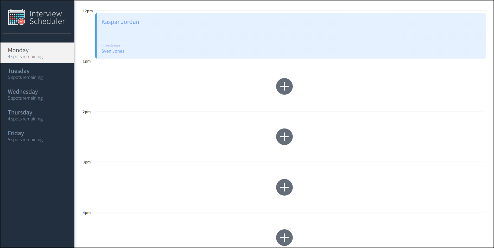

# Interview Scheduler

**Video of functionality:**

https://github.com/kazvee/scheduler/assets/109990289/3c60e71c-5562-438f-b21a-d22b7da7846c

**Video of Cypress test runner:**

https://github.com/kazvee/scheduler/assets/109990289/c4b6eb64-4c2e-4d90-b521-71fea6d6b079

**Screenshot of Scheduler:**



## Setup

Install dependencies with `npm install`.

## Running Webpack Development Server

```sh
npm start
```

## Running Jest Test Framework

```sh
npm test
```
